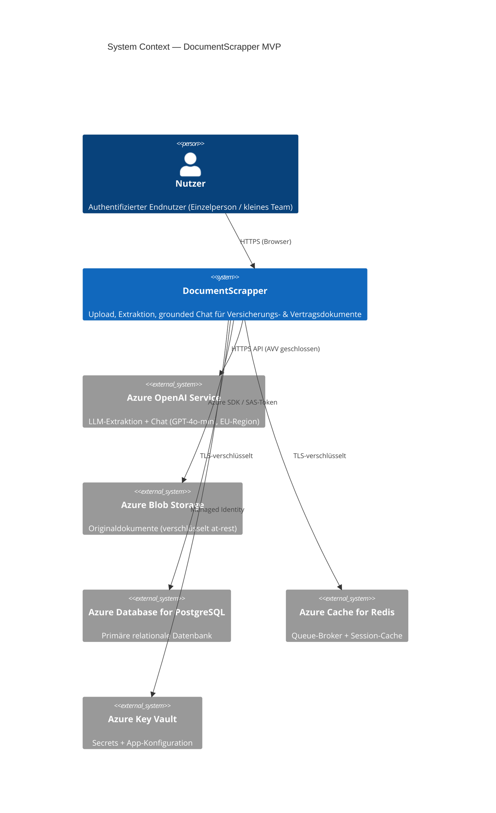
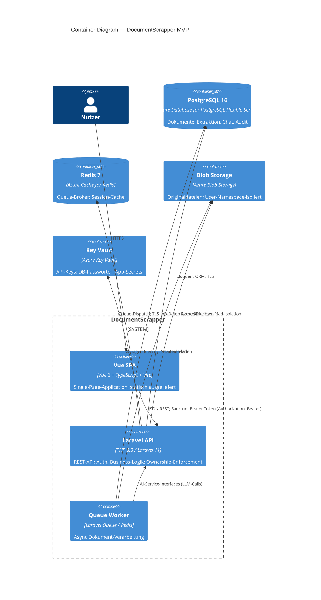
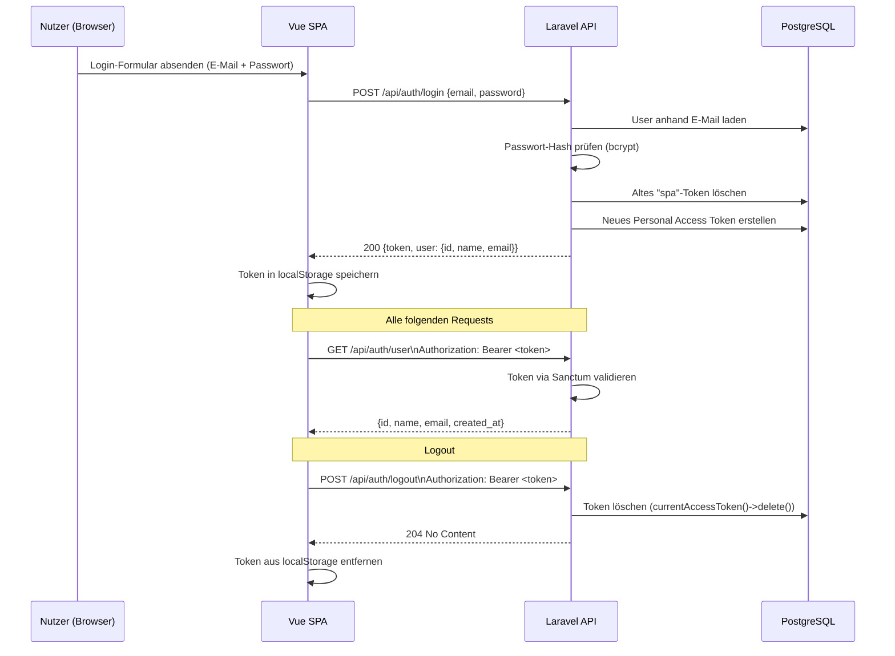
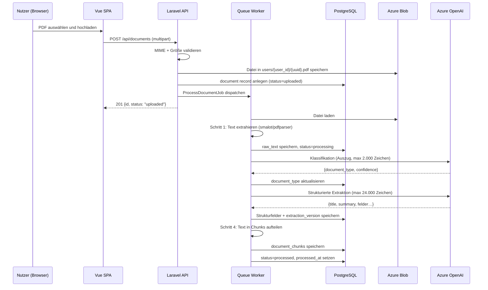
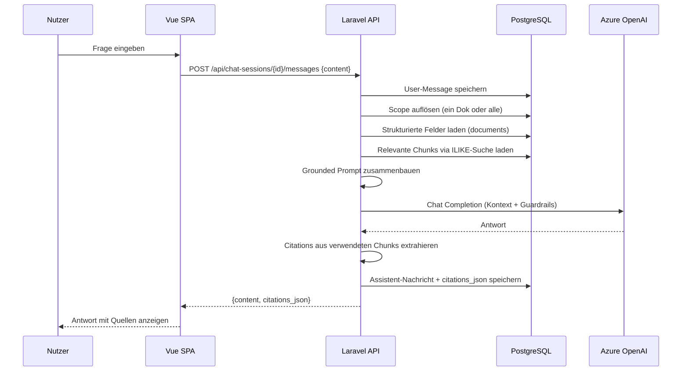
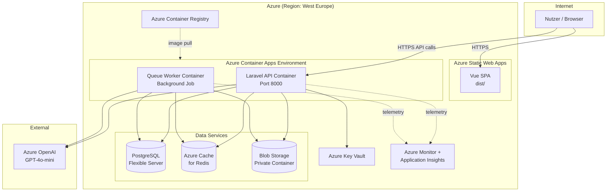

# Systemarchitektur — DocumentScrapper MVP

> Letzte Aktualisierung: Phase-1.1 Auth-Refactor (Bearer Token) · 2026-03-13

---

## 1. Systemkontext (C4 Level 1)



---

## 2. Container-Architektur (C4 Level 2)



---

## 3. Azure Service-Mapping

| Concern | Azure Service | Tier (MVP) | Begründung |
|---------|--------------|-----------|-----------|
| Frontend-Hosting | Azure Static Web Apps oder Azure CDN + Blob | Free/Standard | Statische SPA; keine Server-Kosten |
| Backend API | Azure Container Apps | Consumption | Auto-scale to zero; pay-per-use |
| Queue Worker | Azure Container Apps (separate Job) | Consumption | Gleiche Plattform; Worker skalierbar |
| Datenbank | Azure Database for PostgreSQL Flexible Server | Burstable B1ms | Günstig; JSONB; RLS-fähig |
| File Storage | Azure Blob Storage | LRS Hot Tier | AVV-konform; private Container |
| Queue / Cache | Azure Cache for Redis | C0 Basic | Einfach; Laravel Queue out-of-the-box |
| Secrets | Azure Key Vault | Standard | Kein Secret in Umgebungsvariablen direkt |
| Monitoring | Azure Monitor + Application Insights | Basic | Error-Tracking; keine PII in Traces |
| Container-Registry | Azure Container Registry | Basic | API + Worker Images |

---

## 4. Datenfluss — Authentifizierung



---

## 5. Datenfluss — Dokument-Ingestion



---

## 6. Datenfluss — Chat



---

## 7. Deployment-Architektur (MVP)



---

## 8. Komponentenverantwortlichkeiten

### Vue SPA
- Benutzeroberfläche
- Kein Dokumentinhalt wird gecacht
- Auth via Sanctum Personal Access Token; Token in `localStorage`, gesendet als `Authorization: Bearer <token>`
- Status-Polling für Verarbeitungsstatus

### Laravel API
- Auth via Sanctum Token-Auth (`auth:sanctum` Middleware)
- Ownership-Enforcement via Policies
- Upload-Validierung + Storage-Delegation
- Chat-Orchestrierung (Retrieval → Prompt → LLM → Citations)
- Strukturiertes Logging (kein PII, keine Dokumentinhalte)
- Audit-Log-Schreibung

### Queue Worker
- Asynchrone Dokumentverarbeitung
- Idempotentes Job-Handling (Retries sicher)
- Kein HTTP-Zugriff von außen
- Fehler → `document.status = failed` + `audit_log`

---

## 9. AI-Service-Abstraktion

Alle KI-relevanten Operationen laufen hinter Interfaces:

```
app/Services/AI/
  Contracts/
    TextExtractorInterface         → PdfTextExtractor (MVP)
    DocumentClassifierInterface    → AzureOpenAiClassifier (MVP)
    StructuredExtractorInterface   → AzureOpenAiExtractor (MVP)
    ChunkerInterface               → SimpleChunker (MVP)
    RetrieverInterface             → DbRetriever (MVP) → EmbeddingRetriever (Post-MVP)
    ChatAnswererInterface          → AzureOpenAiChatAnswerer (MVP)
```

**Ziel:** Laravel bleibt der produktive Backend-Core. KI-Logik kann später in einen dedizierten Python/FastAPI-Service ausgelagert werden, ohne API-Änderungen.

---

## 10. Skalierungsevolution

| Phase | Änderung |
|-------|---------|
| MVP | Keyword-Retrieval (PostgreSQL ILIKE), SimpleChunker |
| Post-MVP 1 | pgvector-Embeddings, semantische Suche |
| Post-MVP 2 | Dedizierter Python AI-Service (FastAPI) hinter Interface |
| Post-MVP 3 | Azure AI Search statt selbst-gehosteter Vektorsuche |

---

*Architekturdokument — DocumentScrapper Phase 0*
