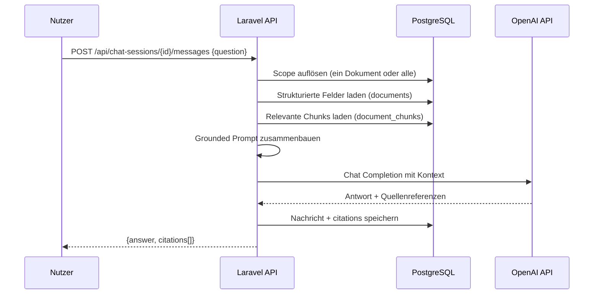

# Chat / RAG Architecture — DocumentScrapper MVP

## Ziel

Der Chat erlaubt es Nutzern, Fragen zu einem einzelnen Dokument oder allen ihren Dokumenten zu stellen. Antworten sind ausschließlich in den hochgeladenen Dokumenten geerdet. Citations (Quellenverweise) werden zurückgegeben.

---

## Architektur



---

## Chat-Scopes

| Scope | Beschreibung | Bedingung |
|-------|-------------|-----------|
| Single Document | Nur Chunks + Felder eines Dokuments | `chat_sessions.document_id IS NOT NULL` |
| All Documents | Alle Dokumente des Nutzers | `chat_sessions.document_id IS NULL` |

Ownership wird immer serverseitig geprüft: Nutzer kann nur auf eigene Dokumente zugreifen.

---

## Retrieval-Strategie (MVP)

**Keine Vektor-Datenbank in MVP.**

Retrieval = Keyword-basierte Suche via PostgreSQL:

```sql
SELECT *
FROM document_chunks dc
JOIN documents d ON dc.document_id = d.id
WHERE d.user_id = :user_id
  AND (d.id = :document_id OR :document_id IS NULL)
  AND dc.chunk_text ILIKE '%' || :query || '%'
ORDER BY dc.chunk_index
LIMIT 5;
```

Zusätzlich werden immer die strukturierten Felder (summary, key metadata) des Dokuments als Kontext mitgegeben.

**Vorbereitet für spätere Vektorsuche:**
- `RetrieverInterface` abstrahiert die Retrieval-Logik
- `DbRetriever` ist MVP-Implementierung
- `EmbeddingRetriever` kann später ohne API-Änderung hinzukommen

---

## Prompt-Aufbau

```
SYSTEM:
Du bist ein Dokumentenassistent. Beantworte Fragen ausschließlich basierend auf dem 
bereitgestellten Dokumentkontext. Falls die Antwort nicht im Kontext enthalten ist, 
sage das klar. Gib keine Rechtsberatung und erfinde keine Fakten.

CONTEXT:
=== Dokument: {document_title} ===
Typ: {document_type}
Zusammenfassung: {summary}
Wichtige Felder:
- Vertragspartner: {counterparty_name}
- Vertragsnehmer: {contract_holder_name}
- Laufzeit: {start_date} bis {end_date}
- Beitrag: {payment_amount} {payment_currency} ({payment_interval})
- Kündigungsfrist: {cancellation_period}

Relevante Textabschnitte:
[Chunk 1, Seite X]: {chunk_text}
[Chunk 2, Seite Y]: {chunk_text}
...

USER:
{user_question}

ASSISTANT:
[Antwort auf Basis des Kontexts, mit Quellenangabe]
```

---

## Guardrails

Folgende Guardrails sind im System-Prompt verankert:

1. **Nur aus Kontext antworten** — Keine Informationen außerhalb der bereitgestellten Chunks
2. **Fehlende Informationen transparent machen** — "Diese Information ist im Dokument nicht enthalten"
3. **Keine Rechtsberatung** — Kein Satz wie "Sie sollten rechtlich..."
4. **Keine Halluzination** — Bei Unsicherheit Einschränkung formulieren
5. **Disclaimer bei sensiblen Fragen** — Hinweis auf professionelle Beratung

---

## Citations-Format

```json
[
  {
    "document_id": "uuid",
    "document_title": "Haftpflichtversicherung Beispiel AG",
    "chunk_index": 3,
    "page_reference": 2,
    "excerpt": "Die Kündigungsfrist beträgt drei Monate zum Ende der Vertragslaufzeit."
  }
]
```

---

## Service-Interface

```php
interface ChatAnswererInterface
{
    public function answer(ChatRequest $request): ChatResponse;
}

class ChatRequest
{
    public string $question;
    public array $documentContexts; // DocumentContext[]
    public array $chunks;           // ChunkItem[]
    public array $chatHistory;      // ChatMessage[]
}

class ChatResponse
{
    public string $answer;
    public array $citations; // Citation[]
}
```

---

## Retrieval-Interface

```php
interface RetrieverInterface
{
    public function retrieve(
        string $query,
        string $userId,
        ?string $documentId = null,
        int $limit = 5
    ): array; // ChunkItem[]
}
```

---

## Skalierungshinweis (Post-MVP)

Wenn das Dokumentvolumen wächst:
1. Embeddings generieren und in PostgreSQL `pgvector` oder Weaviate speichern
2. `EmbeddingRetriever` hinter `RetrieverInterface` implementieren
3. Keine API-Änderungen notwendig

---

## Token-Management

| Komponente | Max Tokens (MVP) |
|------------|-----------------|
| System Prompt | ~300 |
| Dokument-Metadaten | ~200 |
| Chunks | ~2.000 |
| Chat History | ~500 (letzte 3 Nachrichten) |
| Antwort | ~800 |
| **Gesamt** | **~3.800 / 8.192 (GPT-4o-mini)** |

---

*Letzte Aktualisierung: Phase 0 Bootstrap*
