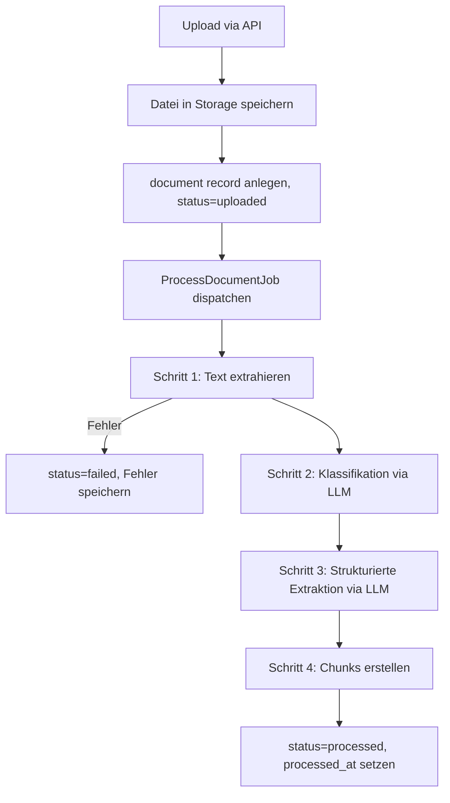

# Document Ingestion Pipeline — DocumentScrapper MVP

## Überblick

Die Ingestion-Pipeline verarbeitet ein hochgeladenes Dokument asynchron in klar getrennten Schritten. Jeder Schritt ist idempotent und unabhängig testbar.



---

## Pipeline-Schritte

### Schritt 1 – Textextraktion

**Ziel:** Rohen Text aus dem Dokument extrahieren.

**Implementierung (MVP):**
- `smalot/pdfparser` für text-basierte PDFs
- Gibt `raw_text` als String zurück
- Seitenreferenzen werden extrahiert, sofern verfügbar
- OCR ist in MVP **nicht** enthalten; scan-basierte PDFs werden als `raw_text = null` markiert

**Fehlerbehandlung:**
- Defekte oder verschlüsselte PDFs → `status = failed`, `processing_error = "text_extraction_failed: <technische Beschreibung>"`
- Keine Document-Inhalte in Fehler-Logs

**Interface:**
```php
interface TextExtractorInterface
{
    public function extract(string $storagePath): ExtractionResult;
}

class ExtractionResult
{
    public string $rawText;
    public ?int $pageCount;
    public bool $success;
    public ?string $errorCode;
}
```

---

### Schritt 2 – Dokumentklassifikation

**Ziel:** Das Dokument grob kategorisieren.

**Kategorien (MVP):**
- `haftpflichtversicherung`
- `hausratversicherung`
- `krankenversicherung`
- `lebensversicherung`
- `kfz_versicherung`
- `mietvertrag`
- `arbeitsvertrag`
- `allgemeiner_vertrag`
- `unknown`

**Implementierung:**
- Erster Ausschnitt des `raw_text` (max. 2.000 Zeichen) wird an LLM übergeben
- Strukturierter JSON-Output via Function Calling / Structured Outputs
- Unbekannte Dokumente erhalten `document_type = "unknown"` – keine Blockierung

**Prompt-Prinzip:**
- Nur technische Kategorie zurückgeben
- Kein PII in Antwort oder Logging

**Interface:**
```php
interface DocumentClassifierInterface
{
    public function classify(string $rawText): ClassificationResult;
}

class ClassificationResult
{
    public string $documentType;
    public float $confidence;
}
```

---

### Schritt 3 – Strukturierte Extraktion

**Ziel:** Normalisierte Felder aus dem Dokumenttext extrahieren.

**Zu extrahierende Felder:**

| Feld | Typ | Beschreibung |
|------|-----|--------------|
| title | string | Dokumenttitel |
| summary | string | 2-3 Sätze Zusammenfassung |
| counterparty_name | string | Versicherer / Vertragspartner |
| contract_holder_name | string | Versicherungsnehmer / Auftraggeber |
| contract_number | string | Vertragsnummer |
| policy_number | string | Policennummer |
| start_date | date | Vertragsbeginn |
| end_date | date | Vertragsende |
| duration_text | string | Laufzeit in Textform |
| cancellation_period | string | Kündigungsfrist |
| payment_amount | decimal | Beitrag / Zahlung |
| payment_currency | string | Währung (default: EUR) |
| payment_interval | string | jährlich / monatlich / ... |
| important_terms | string | Wichtige Konditionen |
| exclusions | string | Ausschlüsse |
| contact_details | string | Kontaktinformationen |
| custom_fields_json | json | Weitere relevante Felder |

**Implementierung:**
- Gesamten `raw_text` senden (ggf. auf 8.000 Token begrenzen)
- JSON-Schema als Anweisung mitgeben
- Fehlende Felder → `null`, keine Halluzination
- `extraction_version` in DB gespeichert (z. B. `"v1-gpt4o-mini"`)

**Wichtig:** Extraktionsergebnis ist immer eine Schätzung. Keine juristischen Aussagen.

**Interface:**
```php
interface StructuredExtractorInterface
{
    public function extract(string $rawText, string $documentType): ExtractionFields;
}
```

---

### Schritt 4 – Chunking

**Ziel:** Text in kleinere Einheiten zerlegen für Retrieval.

**Strategie (MVP):**
- Fenstergröße: 800 Tokens
- Überlappung: 100 Tokens
- Splitting an Absatz- / Satzgrenzen bevorzugt
- Jeder Chunk enthält: `chunk_text`, `chunk_index`, `page_reference` (wenn verfügbar)

**Retrieval im MVP:**
- Keine Vektordatenbank in MVP
- Retrieval = Volltext-Suche über `document_chunks.chunk_text` mit PostgreSQL `ILIKE`
- Bei niedrigem Volumen ausreichend; vorbereitet für spätere Einbettung

**Interface:**
```php
interface ChunkerInterface
{
    public function chunk(string $rawText): array; // ChunkItem[]
}

class ChunkItem
{
    public int $chunkIndex;
    public string $chunkText;
    public ?int $pageReference;
    public int $tokenCount;
}
```

---

## Job-Klasse

```php
// app/Jobs/ProcessDocumentJob.php
class ProcessDocumentJob implements ShouldQueue
{
    use InteractsWithQueue, Queueable, SerializesModels;

    public int $tries = 3;
    public int $backoff = 60; // seconds

    public function handle(
        TextExtractorInterface $extractor,
        DocumentClassifierInterface $classifier,
        StructuredExtractorInterface $structuredExtractor,
        ChunkerInterface $chunker,
    ): void {
        // 1. Load document
        // 2. Extract text
        // 3. Classify
        // 4. Extract structured fields
        // 5. Create chunks
        // 6. Update status = processed
    }

    public function failed(Throwable $exception): void {
        // Update document.status = failed
        // Store processing_error (no document content in log)
    }
}
```

---

## Fehlerszenarien

| Szenario | Verhalten |
|----------|-----------|
| Leere PDF | `status = failed`, `processing_error = "empty_content"` |
| Verschlüsselte PDF | `status = failed`, `processing_error = "encrypted_file"` |
| LLM-API-Fehler | Retry bis max 3, dann `failed` |
| Unbekanntes Format | `document_type = unknown`, Pipeline läuft weiter |
| Timeout | Exponentielles Backoff, dann `failed` |

---

## Idempotenz

Der Job ist idempotent:
- Bestehende Chunks werden vor Neu-Erstellung gelöscht (`DELETE WHERE document_id = ?`)
- `document_structured_data.is_latest` wird auf `false` gesetzt vor Neu-Schreiben
- Status-Updates nutzen atomare Writes

---

*Letzte Aktualisierung: Phase 0 Bootstrap*
