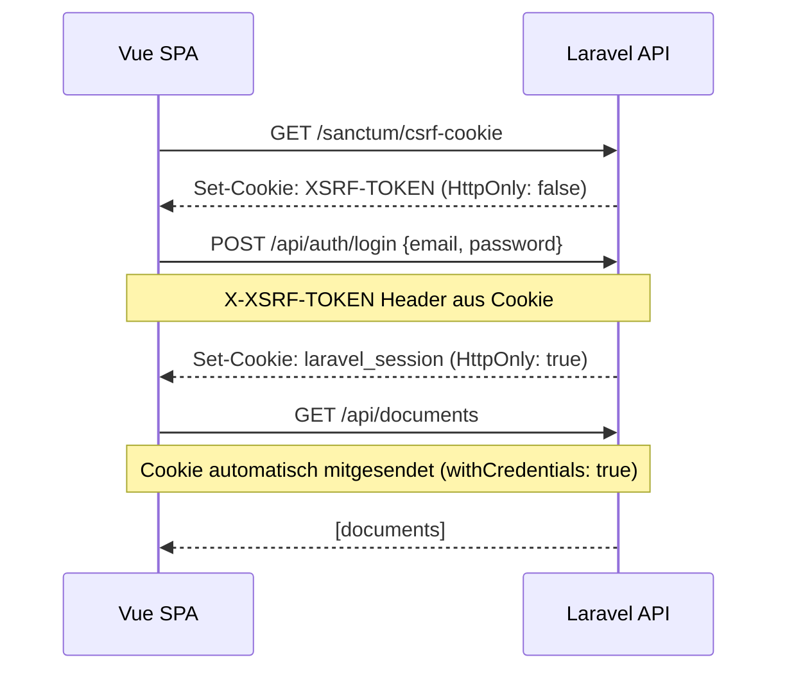
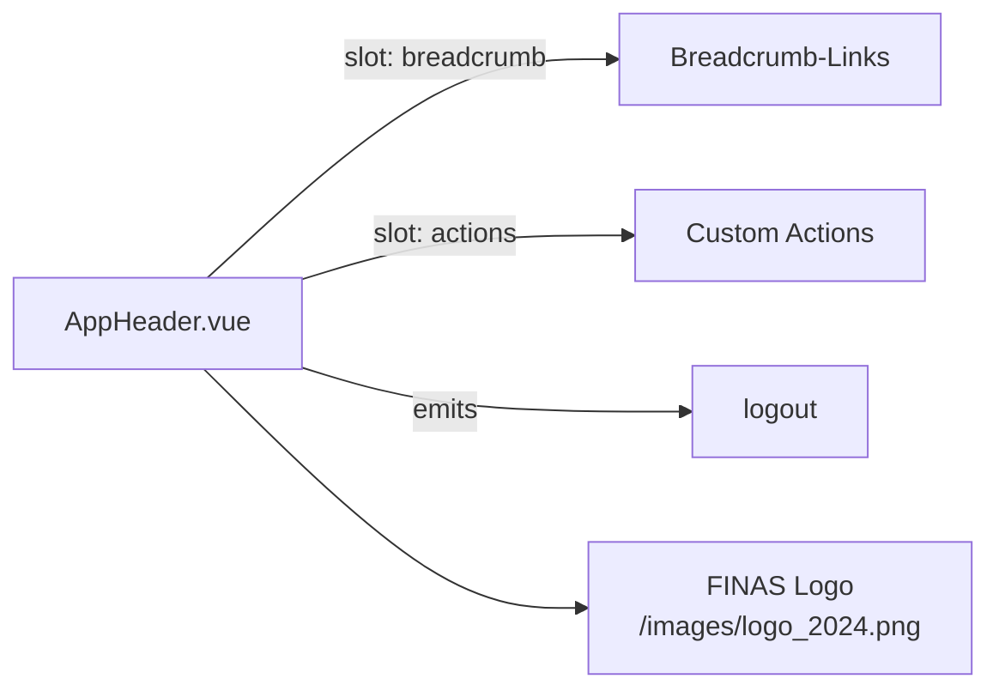

# Frontend-Architektur — DocumentScrapper MVP

> Letzte Aktualisierung: Phase-1.2 FINAS Branding · 2026-03-13

---

## 1. Überblick

Das Frontend ist eine **Vue 3 Single-Page-Application** (SPA), die als statische Dateien ausgeliefert wird. Alle Daten kommen ausschließlich vom Laravel API Backend.

```
Vue SPA (statisch) → Laravel API (JSON REST) → PostgreSQL / Azure Blob / Azure OpenAI
```

**Kein Dokumentinhalt wird im Browser gecacht** (kein localStorage mit sensiblen Daten).

---

## 2. Tech-Stack Frontend

| Technologie | Version | Entscheidung |
|-------------|---------|-------------|
| Vue 3 (Composition API) | ^3.4 | Reaktive SPA, exzellenter TS-Support |
| TypeScript | ^5.x | Typsicherheit für alle Interfaces |
| Vite | ^5.x | Schneller Dev-Server, optimierter Build |
| Vue Router | ^4.3 | Client-seitiges SPA-Routing |
| Pinia | ^2.1 | Einfaches, typisiertes State Management |
| Axios | ^1.7 | HTTP-Client mit Auth-Interceptors |
| Tailwind CSS | ^4.x | Utility-first CSS, kein komponentenbibliothekenabhängig |

---

## 3. Verzeichnisstruktur

```
/web
  src/
    api/                    # HTTP-Calls pro Domain
      client.ts             # Axios-Instanz + Auth + Error-Handling
      auth.ts               # Login, Logout, getUser
      documents.ts          # Upload, List, Get, Delete
      chat.ts               # Sessions, Messages
    assets/
      tailwind.css          # Tailwind v4 Import
    components/
      common/               # Wiederverwendbare Basiskomponenten
        AppHeader.vue         # Globaler Header mit FINAS-Logo, Logout, Breadcrumb-Slot
        AppSpinner.vue
      documents/            # Dokumenten-spezifische Komponenten
        DocumentStatusBadge.vue
    composables/            # Wiederverwendbare Composition-Logik
      useDocumentPolling.ts # Status-Polling für Verarbeitung
    pages/                  # Routen-Komponenten
      LoginPage.vue
      DocumentsPage.vue
      DocumentDetailPage.vue
      ChatPage.vue
      NotFoundPage.vue
    router/
      index.ts              # Routen + Auth Guards
    stores/                 # Pinia State Stores
      auth.ts               # User, Login, Logout
      documents.ts          # Dokument-Liste, Upload, Status
      chat.ts               # Sessions, Nachrichten
    types/                  # TypeScript-Interfaces
      document.ts
      chat.ts
      auth.ts
  public/
    images/
      logo_2024.png         # FINAS Versicherungsmakler GmbH — Branding-Asset
  index.html
  vite.config.ts
  tailwind.config.js
  postcss.config.js
  tsconfig.json
  .env.example
```

---

## 4. Routing und Navigation

### Routen

| Route | Seite | Auth | Beschreibung |
|-------|-------|------|-------------|
| `/login` | LoginPage | Nein | Anmelden |
| `/` | Redirect → `/documents` | Nein | - |
| `/documents` | DocumentsPage | **Ja** | Übersicht + Upload |
| `/documents/:id` | DocumentDetailPage | **Ja** | Extraktion + Status |
| `/chat/:sessionId` | ChatPage | **Ja** | Chat-Interface |
| `*` | NotFoundPage | - | 404 |

### Auth Guard

```typescript
router.beforeEach(async (to) => {
  const authStore = useAuthStore();
  if (to.meta.requiresAuth && !authStore.isAuthenticated) {
    return { name: 'login', query: { redirect: to.fullPath } };
  }
});
```

---

## 5. State Management (Pinia)

### Auth Store (`stores/auth.ts`)

```typescript
State:
  user: User | null
  isAuthenticated: computed

Actions:
  initialize()   // Beim App-Start: getUser() aufrufen
  login()        // POST /api/auth/login
  logout()       // POST /api/auth/logout + clearUser
  clearUser()    // Bei 401-Response
```

### Documents Store (`stores/documents.ts`)

```typescript
State:
  documents: Document[]
  currentDocument: Document | null
  isLoading: boolean
  uploadProgress: number
  error: string | null

Actions:
  fetchDocuments()          // GET /api/documents
  fetchDocument(id)         // GET /api/documents/:id
  uploadDocument(file)      // POST /api/documents (multipart)
  refreshDocument(id)       // Polling-Refresh
  deleteDocument(id)        // DELETE /api/documents/:id
```

### Chat Store (`stores/chat.ts`)

```typescript
State:
  sessions: ChatSession[]
  currentSession: ChatSession | null
  messages: ChatMessage[]
  isLoading: boolean
  isSending: boolean
  error: string | null

Actions:
  fetchSessions()                     // GET /api/chat-sessions
  createSession(documentId?, title?)  // POST /api/chat-sessions
  loadSession(session)                // GET messages
  sendMessage(content)                // POST messages + optimistic UI
```

---

## 6. API-Client und Auth

### Sanctum Cookie-Flow



### 401-Interceptor

```typescript
client.interceptors.response.use(
  (res) => res,
  (error) => {
    if (error.response?.status === 401) {
      authStore.clearUser();
      router.push({ name: 'login' });
    }
    return Promise.reject(error);
  }
);
```

---

## 7. FINAS Branding & Design-System

### Übersicht

Die App verwendet ein zentrales Theming-Layer auf Basis von **Tailwind CSS v4 `@theme`**-Tokens. Alle Farben und Schriften sind in einer einzigen Datei definiert — keine gestreuten Hex-Werte in Komponenten.

**Tokenquelle:** `web/src/assets/tailwind.css`

### Design-Tokens

| Token | Wert | Verwendung |
|-------|------|-----------|
| `--color-brand` | `#005d22` | Buttons, Links, aktive States, Fokus-Ringe |
| `--color-brand-hover` | `#004a1b` | Hover-State für Brand-Elemente |
| `--color-brand-soft` | `#e8f5ec` | Hintergründe, Drag-Zonen, Upload-Progress |
| `--color-brand-muted` | `#c3e0cc` | Progress-Bars, dezente Akzente |
| `--color-surface` | `#ffffff` | Karten, Modal-Hintergründe |
| `--color-surface-subtle` | `#f8f9fa` | Seiten-Hintergrund, leere Zustände |
| `--color-border` | `#ced4da` | Standard-Ränder |
| `--color-border-subtle` | `#dee2e6` | Subtile Trennlinien |
| `--color-danger` | `#dc3545` | Fehlermeldungen, Löschen-Aktionen |
| `--color-danger-soft` | `#f8d7da` | Fehler-Hintergründe |

### Logo-Asset

- **Pfad:** `web/public/images/logo_2024.png`
- **Eingebunden in:** `AppHeader.vue` + `LoginPage.vue`
- **Alt-Text:** `FINAS Versicherungsmakler GmbH`
- **Responsive:** Fixhöhe `h-9` (Header) / `h-14` (Login), Breite `auto`, `object-contain`

### AppHeader-Komponente

`src/components/common/AppHeader.vue` ist der zentrale App-Shell-Header, der auf allen authentifizierten Seiten verwendet wird.

**Props:**
- `showLogout: boolean` — Zeigt Abmelden-Button

**Emits:**
- `logout` — Abmelde-Action

**Slots:**
- `#breadcrumb` — Optionale Breadcrumb-Navigation (Desktop inline, Mobile unter Header)
- `#actions` — Optionale rechtsseitige Actions

**Komponentenstruktur:** → [docs/diagrams/frontend/component-structure.mmd](./diagrams/frontend/component-structure.mmd)



### Farbanpassung

Um Farben später zu ändern:
1. `web/src/assets/tailwind.css` öffnen
2. Im `@theme`-Block die gewünschten CSS-Variablen anpassen
3. Keine weiteren Dateien müssen angefasst werden

---

## 8. Mobile-First Design

### Viewport-Strategie

| Breakpoint | Breite | Anpassungen |
|-----------|--------|-------------|
| Mobile | 390px | Cards statt Tabellen, 1 Spalte |
| Tablet | 768px | 2 Spalten optional |
| Desktop | 1024px+ | max-w-5xl Wrapper |

### Touch-Target-Regel

Alle interaktiven Elemente: **mindestens 44×44px**.

### Kein Horizontal-Scroll

- Kein `overflow-x: visible` auf Content
- Lange Texte mit `truncate` oder `break-words`
- Keine festen Breiten unter 390px

---

## 8. States — Vollständige Abdeckung

Jede Seite und jede Datenansicht implementiert:

| State | Implementierung |
|-------|----------------|
| **Loading** | `AppSpinner` zentriert, Seite deaktiviert |
| **Empty** | `EmptyState` mit erklärendem Text + CTA |
| **Error** | Roter Banner mit Nachricht + optionalem Retry |
| **Processing** | `DocumentStatusBadge` mit Animation |
| **Success** | Normaler Inhalt |

---

## 9. Sicherheitsregeln im Frontend

| Regel | Begründung |
|-------|-----------|
| Kein Dokumentinhalt in `localStorage` | Verhindert Browser-Persistence von Vertragsdaten |
| Kein `localStorage` für Auth-Token | HttpOnly Cookie schützt vor XSS |
| Kein `innerHTML` mit API-Daten | XSS-Schutz |
| Kein direkter Azure Blob Storage Zugriff | Alle Downloads über Auth-API |
| Status-Anzeige statt Inhalt bei `processing` | Kein Partial-Content anzeigen |

---

## 10. TypeScript-Interfaces

```typescript
// types/document.ts
export type DocumentStatus = 'uploaded' | 'processing' | 'processed' | 'failed'

export interface Document {
  id: string
  original_filename: string
  mime_type: string
  size_bytes: number
  status: DocumentStatus
  document_type: string | null
  title: string | null
  summary: string | null
  // ... alle Strukturfelder als optional
}

// types/chat.ts
export interface Citation {
  document_id: string
  document_title: string
  chunk_index: number
  page_reference: number | null
  excerpt: string
}

export interface ChatMessage {
  id: string
  role: 'user' | 'assistant' | 'system'
  content: string
  citations_json: Citation[]
  created_at: string
}
```

---

## 11. Build und Deployment

### Lokal

```bash
cd web
cp .env.example .env
npm install
npm run dev        # http://localhost:5173
```

### Production Build

```bash
npm run build      # → dist/
```

### Azure Static Web Apps

```yaml
# .github/workflows/azure-static-web-apps.yml
- name: Build and Deploy
  uses: Azure/static-web-apps-deploy@v1
  with:
    azure_static_web_apps_api_token: ${{ secrets.AZURE_STATIC_WEB_APPS_TOKEN }}
    repo_token: ${{ secrets.GITHUB_TOKEN }}
    app_location: "web"
    output_location: "dist"
```

### SPA-Fallback (nginx / Azure SWA)

```nginx
location / {
    try_files $uri $uri/ /index.html;
}
```

---

## 12. Umgebungsvariablen Frontend

```env
# web/.env.example
VITE_API_URL=http://localhost:8000
```

**Wichtig:** Keine Secrets im Frontend — VITE_-Variablen sind öffentlich sichtbar.

---

*Frontend-Architektur — DocumentScrapper Phase 0*
